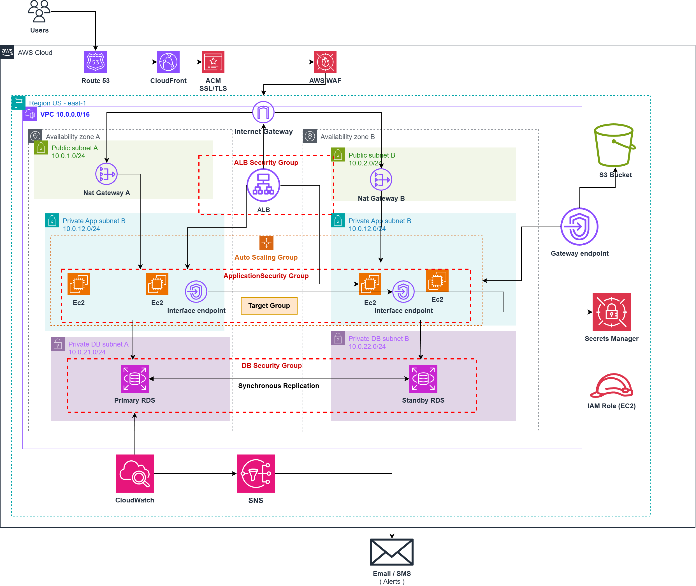

# AWS Highly Available 3-Tier Web Architecture

A highly available, scalable, and secure traditional 3-tier web architecture designed on AWS using Amazon VPC, Application Load Balancer, Auto Scaling, Amazon RDS Multi-AZ, Amazon S3, AWS Secrets Manager, Amazon CloudFront, AWS WAF, AWS Certificate Manager, Amazon CloudWatch, and Amazon SNS.

## Project Overview

This project demonstrates the design of a highly available and secure traditional 3-tier web application architecture deployed on AWS.

The architecture is distributed across two Availability Zones and uses separate public, private application, and private database subnets to provide network isolation, high availability, scalability, and security.

## Solution Architecture



## Architecture Components

| Layer | AWS Service | Purpose |
|---|---|---|
| DNS | Amazon Route 53 | DNS resolution for the application |
| CDN | Amazon CloudFront | Content delivery and caching |
| TLS | AWS Certificate Manager | SSL/TLS certificate management |
| Security | AWS WAF | Web application protection |
| Networking | Amazon VPC | Network isolation |
| Networking | Internet Gateway | Internet connectivity for public resources |
| Networking | NAT Gateway | Outbound internet access for private resources |
| Load Balancing | Application Load Balancer | Distributes incoming application traffic |
| Compute | Amazon EC2 | Hosts the application |
| Scaling | Auto Scaling Group | Automatically manages EC2 capacity |
| Database | Amazon RDS Multi-AZ | Highly available relational database |
| Storage | Amazon S3 | Object storage |
| Security | AWS IAM | Identity and access management |
| Security | AWS Secrets Manager | Secure credential management |
| Networking | VPC Endpoints | Private connectivity to AWS services |
| Monitoring | Amazon CloudWatch | Monitoring and alarms |
| Notifications | Amazon SNS | Alert notifications |

## Network Architecture

The VPC uses a `10.0.0.0/16` CIDR block and spans two Availability Zones.

The network is divided into six subnets across three tiers: Public, Application, and Database.

| **Tier** | **Subnet Name** | **AZ** | **CIDR Block** | **Routing & Access** |
|---|---|---|---|---|
| **Public** | `Public-Subnet-A` | `us-east-1a` | `10.0.1.0/24` | IGW Route, ALB, NAT Gateway A |
| **Public** | `Public-Subnet-B` | `us-east-1b` | `10.0.2.0/24` | IGW Route, ALB, NAT Gateway B |
| **App** | `Private-App-A` | `us-east-1a` | `10.0.11.0/24` | NAT GW-A Route, EC2, VPC Endpoints |
| **App** | `Private-App-B` | `us-east-1b` | `10.0.12.0/24` | NAT GW-B Route, EC2, VPC Endpoints |
| **Database** | `Private-DB-A` | `us-east-1a` | `10.0.21.0/24` | Local Route Only, RDS Primary |
| **Database** | `Private-DB-B` | `us-east-1b` | `10.0.22.0/24` | Local Route Only, RDS Standby |

### Availability Zone A

- Public Subnet A
- Private Application Subnet A
- Private Database Subnet A

### Availability Zone B

- Public Subnet B
- Private Application Subnet B
- Private Database Subnet B

The public subnets contain the internet-facing infrastructure, while the application and database tiers remain isolated in private subnets.

## Traffic Flow

The main application traffic follows this path:

```text
User
  |
Route 53
  |
CloudFront
  |
Application Load Balancer
  |
EC2 Instances
  |
RDS Multi-AZ
```

AWS WAF is associated with CloudFront to inspect and filter incoming web requests before they reach the application.

Application servers can also communicate with AWS services through private connectivity:

```text
EC2
  |
  +----> S3 Gateway VPC Endpoint ----> Amazon S3
  |
  +----> Secrets Manager Interface VPC Endpoint
  |                  |
  |                  +----> AWS Secrets Manager
  |
  +----> NAT Gateway ----> Internet
```

## High Availability and Scalability

The architecture is distributed across two Availability Zones to reduce dependency on a single Availability Zone.

High availability is achieved using:

- Application Load Balancer across multiple Availability Zones
- EC2 instances distributed across multiple Availability Zones
- Auto Scaling Group
- RDS Multi-AZ
- NAT Gateway per Availability Zone

The Auto Scaling Group automatically adjusts the number of EC2 instances based on application demand and replaces unhealthy instances when required.

## Security Architecture

The architecture follows a layered security model.

Security controls include:

- HTTPS/TLS
- AWS WAF
- Security Groups
- Private Application Subnets
- Private Database Subnets
- IAM Roles
- AWS Secrets Manager
- VPC Endpoints

The application servers do not accept direct inbound internet traffic. Application traffic is received through the Application Load Balancer.

The database is deployed in private subnets and is accessible only from the application tier.

Security Groups enforce controlled communication between the different tiers:

```text
Internet
   |
CloudFront + WAF
   |
ALB Security Group
   |
Application Security Group
   |
Database Security Group
   |
RDS
```
### Security Group Rule Matrix

| Security Group | Inbound Rules | Outbound Rules | Purpose |
| :--- | :--- | :--- | :--- |
| `ALB-SG` | HTTPS (443) from CloudFront IP prefix / WAF | App Port (8080/80) to `APP-SG` | Controlled entry point |
| `APP-SG` | App Port from `ALB-SG` | Port 3306 to `DB-SG` + HTTPS to VPC Endpoints | Compute isolation |
| `DB-SG` | MySQL/Aurora (3306) from `APP-SG` | None | Fully isolated storage |

## IAM and Secrets Management

EC2 instances use IAM Roles instead of long-term AWS access keys.

Sensitive credentials are stored in AWS Secrets Manager and retrieved by the application when required.

This avoids hard-coding credentials inside the application or server configuration.

## S3 and VPC Endpoints

Amazon S3 is used for object storage.

The application accesses S3 through an S3 Gateway VPC Endpoint:

```text
EC2
  |
S3 Gateway VPC Endpoint
  |
Amazon S3
```

AWS Secrets Manager is accessed through an Interface VPC Endpoint:

```text
EC2
  |
Secrets Manager Interface VPC Endpoint
  |
AWS Secrets Manager
```

These VPC Endpoints provide private connectivity from the application tier to the respective AWS services.

## Monitoring and Alerting

Amazon CloudWatch is used to monitor the infrastructure and application environment.

Examples of monitored metrics include:

- EC2 CPU utilization
- EC2 status checks
- ALB healthy targets
- ALB response time
- ALB HTTP errors
- RDS CPU utilization
- RDS free storage
- RDS database connections

CloudWatch Alarms can send notifications through Amazon SNS.

The monitoring flow is:

```text
CloudWatch Metrics
       |
       v
CloudWatch Alarm
       |
       v
SNS Topic
       |
       v
Email Notification
```

## Failure Testing & Validation Results
To verify high availability and operational resilience, the infrastructure was subjected to manual failure scenarios:

EC2 Node Termination Test: Terminated an active EC2 instance in AZ-A. ALB health checks marked the instance unhealthy within 15 seconds, redirected 100% of traffic to AZ-B, and ASG provisioned a replacement instance automatically.

Auto-Scaling Stress Test: Generated artificial load on instances. CPU utilization crossed the 70% threshold, triggering CloudWatch Alarms to scale out the ASG from 2 to 4 instances.

RDS Multi-AZ Failover Test: Initiated a forced failover on the primary database. RDS switched DNS endpoint resolution to the standby instance in AZ-B automatically with zero application code modifications.

WAF Attack Simulation: Generated malicious request signatures. AWS WAF intercepted and blocked the requests at the CloudFront edge layer (HTTP 403 Forbidden) before reaching the ALB.

## Key Architecture Decisions

### Why two Availability Zones?

Two Availability Zones are used to improve availability and reduce the impact of an Availability Zone failure.

### Why are the EC2 instances private?

The application servers do not require direct inbound internet access. The Application Load Balancer acts as the controlled entry point to the application tier.

### Why use an Application Load Balancer?

The ALB distributes incoming traffic across healthy application instances and integrates with the Auto Scaling Group.

### Why use RDS Multi-AZ?

RDS Multi-AZ provides high availability for the database layer and supports automatic failover.

### Why use an Auto Scaling Group?

The Auto Scaling Group maintains the desired application capacity, replaces unhealthy instances, and allows the application tier to scale horizontally based on demand.

### Why use two NAT Gateways?

A NAT Gateway is deployed in each Availability Zone to avoid making private subnet outbound connectivity dependent on a single Availability Zone.

### Why use VPC Endpoints?

S3 and Secrets Manager can be accessed privately from the application tier without routing those specific service requests through the public internet.

### Why use AWS Secrets Manager?

Secrets Manager securely stores sensitive credentials and allows applications to retrieve them when required without hard-coding credentials.

## Project Objectives

This project demonstrates practical knowledge of:

- AWS VPC architecture
- Multi-AZ design
- Traditional 3-tier architecture
- Application Load Balancing
- Auto Scaling
- RDS Multi-AZ
- AWS security
- IAM
- Secrets Management
- CloudFront
- AWS WAF
- VPC Endpoints
- CloudWatch monitoring
- SNS notifications

## Conclusion

This project demonstrates a traditional 3-tier web application architecture designed for high availability, scalability, security, and operational visibility on AWS.

## Future Enhancements
Infrastructure as Code (IaC): Modularize the entire architecture using Terraform or AWS CDK.

CI/CD Automation: Build GitHub Actions pipelines for automated AMI baking and zero-downtime rolling deployments.

Centralized Operations: Implement AWS Systems Manager (SSM) Session Manager to eliminate SSH key management.

Containerization: Migrate compute workloads from bare EC2 instances to Amazon ECS on AWS Fargate.

The architecture separates the application layers while using multiple Availability Zones, private networking, managed AWS services, and layered security controls to create a resilient and maintainable cloud architecture.
